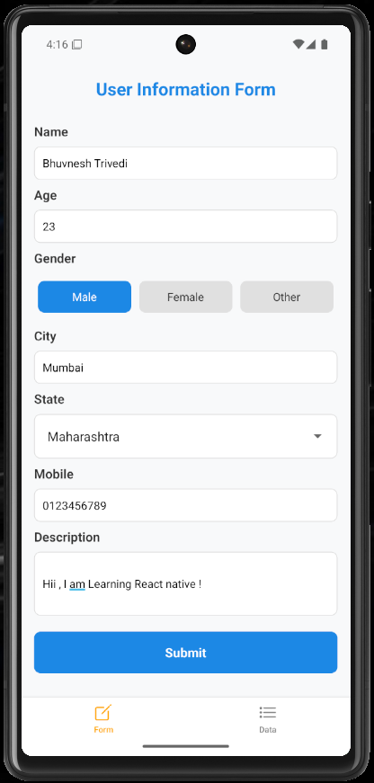
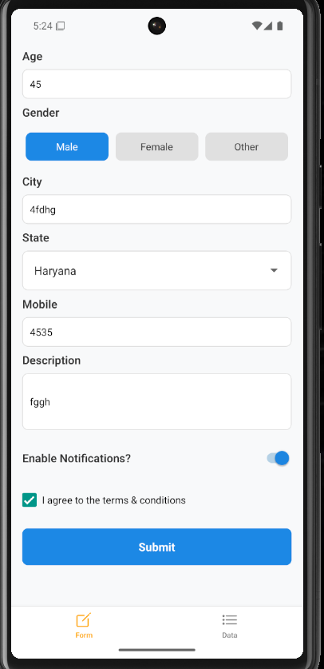
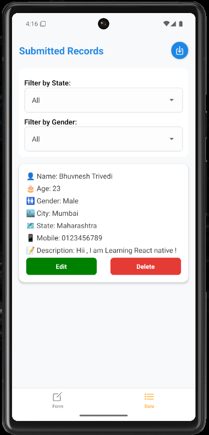

## 📋 FormEase
🚀 FormEase is a cross-platform React Native (Expo) app that lets you create, view, edit, filter, and export form submissions effortlessly.
✅ Works seamlessly on mobile & web, with Excel export support!

## 🖼️ Output  

Here’s how the app looks:  

  
  
  

## ✨ Features
✅ Add & Manage Forms – Submit and store user details
✅ Filter Records – By State & Gender
✅ Edit / Delete Records – Update or remove data easily
✅ Excel Export – Download submissions as .xlsx
✅ Cross-Platform – Works on Android, iOS & Web
✅ Responsive UI – Clean and user-friendly design

## 🖼️ Preview
Here’s how FormEase looks:

## 🛠️ Tech Stack
⚛️ React Native + Expo

📦 expo-router for navigation

🗄 React Hooks for state management

📑 XLSX for Excel generation

📲 expo-sharing & FileSystem for file export

🎨 React Native SafeAreaView for adaptive UI

## 🚀 Getting Started
✅ 1. Clone the Repository
bash
Copy
Edit
git clone https://github.com/Bhuvnesh-Trivedi/FormEase.git
cd FormEase

✅ 2. Install Dependencies
bash
Copy
Edit

npm install
✅ 3. Run on Mobile/Web
📱 Mobile (Expo Go)

bash
Copy
Edit
npx expo start
🌐 Web

bash
Copy
Edit
npx expo start --web

## 📂 Project Structure
bash
Copy
Edit
FormEase/
 ├── app/
 │   ├── index.tsx     # Form Page
 │   ├── data.tsx      # View, Filter & Export Data
 │   └── _layout.tsx   # Expo Router Layout
 ├── package.json
 ├── README.md
 └── ...

## 📤 Export Excel
✅ Web: Downloads directly in the browser
✅ Mobile: Saves to device & opens Share dialog

## 👨‍💻 Author
Bhuvnesh Trivedi
💼 GitHub | 🌐 Portfolio

## ⭐ Contribute
If you like FormEase, don’t forget to ⭐ star this repo on GitHub!